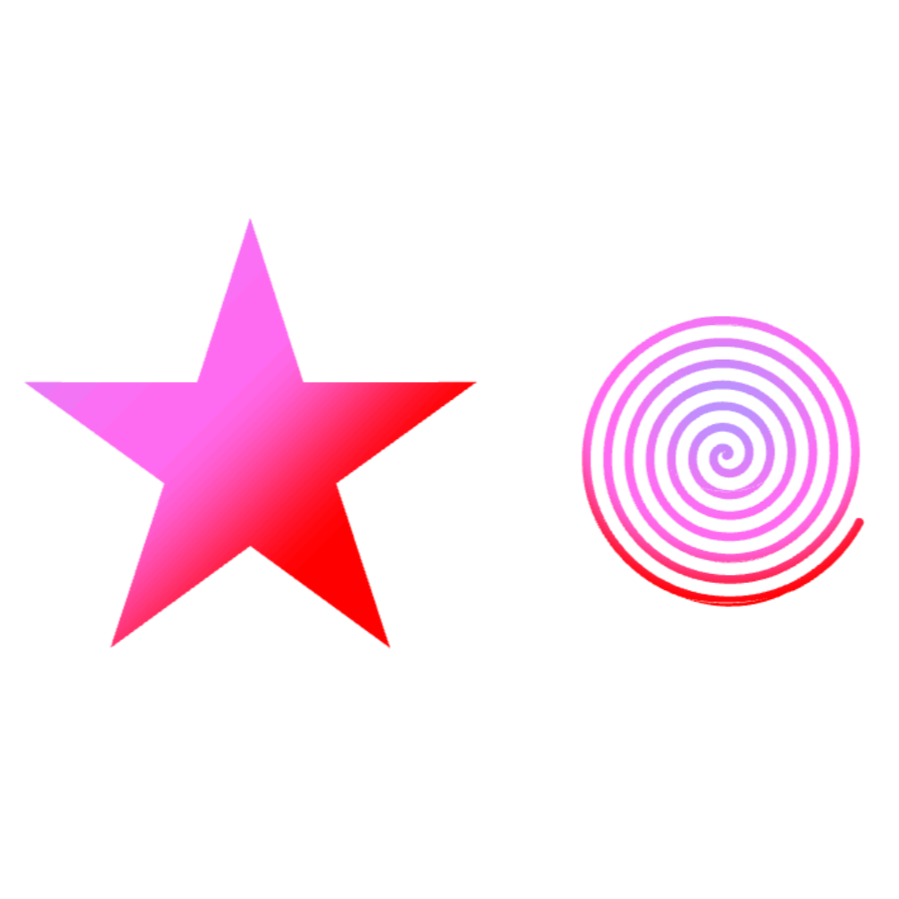

# Happy SVG


Kotlin classes and DSL to create [Happy Wheels](https://totaljerkface.com/happy_wheels.tjf) levels.

---

## Getting started

Add this to your `build.gradle.kts`:

```kotlin
implementation("io.github.mimimishkin:happy-svg:1.0.0")

// to work with svg paths, path transforms and clipping
implementation("io.github.mimimishkin:path-utils:1.0.2")
```

Then you can create a simple level:

```kotlin
val level = happyLevel {
    info {
        character = HappyWheels.Character.MopedCouple
        characterPosition = Vec2(100.0, 100.0)
        backgroundType = HappyWheels.Background.Color
        backgroundColor = Color(0x9DFFCB)
        hideVehicle = true
    }

    content {
        val bounds = Bounds(150.0, 150.0, 100.0, 100.0)

        group {
            layer(isFixed = false, isSleeping = true) {
                rectangle(bounds, Color(209, 206, 30, 100))
                circle(bounds, Color(12, 108, 186, 100))
                triangle(bounds, Color(40, 255, 120, 100))
                
                // `polygon` and `star` creates custom vector paths 
                polygon(polygon(bounds.cx, bounds.cy, bounds.w / 2, tips = 7), Color(255, 101, 180, 100))
                art(star(bounds.cx, bounds.cy, bounds.w / 2), Color(122, 40, 209, 100))
            }
        }
    }
}

println(level.format())
```
Here, every element will be on top of the previous.

## Features

- Creation of all Happy Wheels shapes
- Grouping them (group method in example)
- Convenient mass parameter changing (layer method in example)
- Shapes transforming (any 3x3 matrix transform) and clipping (against any path)
- Ability to draw gradients
- Ability to draw SVG images
- Ability to draw raster images (produces levels too heavy for Happy Wheels, better convert your image to svg and use svg)
- The library also doesn't check polygon's edges count, so you can create complex polygon's like circle sectors easily

## Samples

See helpful samples in [tests](src/test/kotlin/GeneralTests.kt), here are their outputs:





